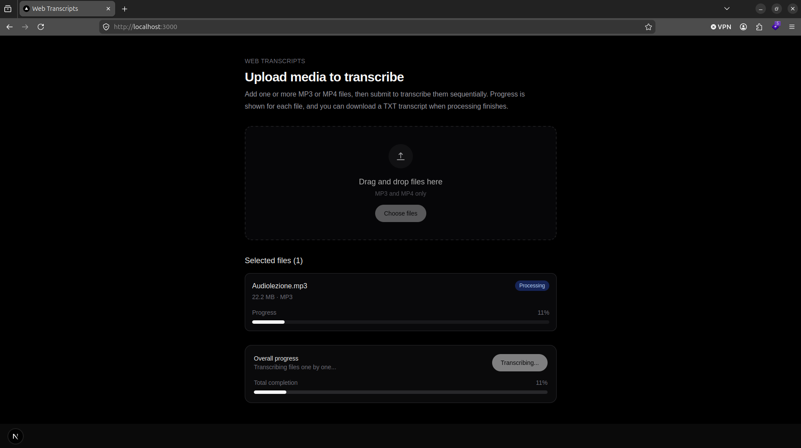

# Transcript
Transcribe mp3 or mp4 into text, this is useful when studying from videos, to create your annotations or study doc.
The app is very easy:
* Backend made in [Fastapi](https://fastapi.tiangolo.com/), so Python, and uses the [Whisper](https://fastapi.tiangolo.com/)
* Webapp (UI) is made in [React](https://react.dev/)

## Backend api

Backend listens on http://localhost:8000

You can also try it via Postman.\
See respective folder for starting it [Backend](Backend/readme.md)

### POST /api/transcribe

Generate the transcript of a file. This method is async so to get the progress and the result you need to poll the /jobs/{jobid}.

Body parameters
* file: This is the mp3 or mp4

### GET /api/jobs/{jobid}

This method is to get the progress and the result of the transcript.

Parameters
* jobid: This is job id returned by the /api/transcribe method

## UI webapplication

UI is a simple rect application\
See respective folder for starting it [UI](UI/README.md)